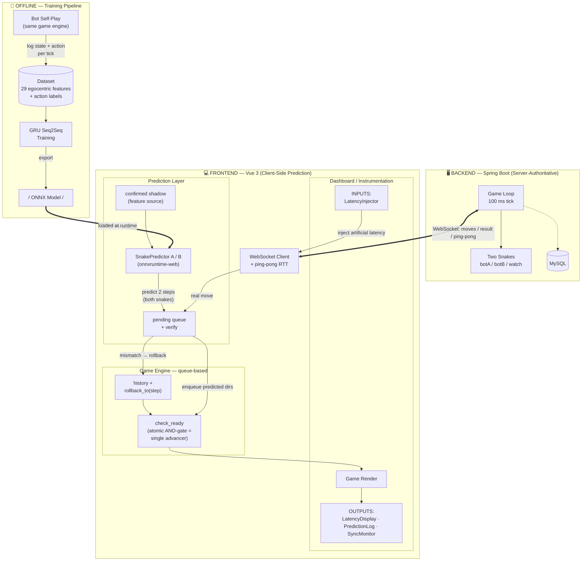
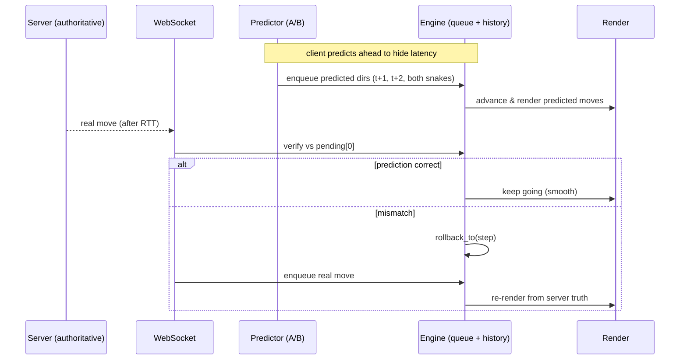
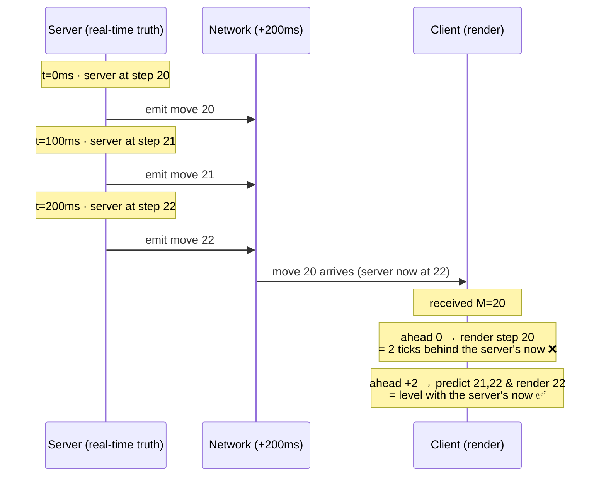

# Project Architecture — Learned Latency Compensation Testbed

## Contents

- [1. System Overview](#1-system-overview)
- [2. Prediction / Reconciliation Loop (per tick)](#2-prediction--reconciliation-loop-per-tick)
- [3. One-line summary](#3-one-line-summary)
- [4. Dashboard Components (Instrumentation Layer)](#4-dashboard-components-instrumentation-layer)
  - [The `ahead` metric](#the-ahead-metric)
- [5. Key Design Rationale (Supervisor Q&A)](#5-key-design-rationale-supervisor-qa)
  - [Q7 follow-up — variable latency / autoregressive](#q7-follow-up--latency-fluctuates--is-non-integer-doesnt-2-step-prediction-break-why-not-dynamicautoregressive-prediction)
- [6. Reading `ahead` correctly — two kinds of "in sync"](#6-reading-ahead-correctly--two-kinds-of-in-sync)
  - [The three-walker model](#the-three-walker-model)
  - [Timeline: client vs server (200ms latency)](#timeline-where-the-client-is-vs-the-server-200ms-latency)
  - [Why `ahead` can't be held at +2](#why-ahead-cant-be-held-at-2-mechanism-recap)

---

## 1. System Overview



## 2. Prediction / Reconciliation Loop (per tick)



## 3. One-line summary

A **learned sequence model (GRU Seq2Seq)** does **client-side latency compensation** in a
**server-authoritative** game. The server owns truth and creates the latency gap; the client
predicts up to **2 steps** (RTT 200ms / tick 100ms) for **both** snakes, renders them
immediately, and **verifies + rolls back** against real server moves. Training data comes
from **bot self-play** in the same engine. A **dashboard** makes latency, predictions, and
sync **observable and controllable** for systematic experiments.

---

## 4. Dashboard Components (Instrumentation Layer)

The four panels turn invisible latency compensation into something **observable and
controllable**. Two are **inputs (controls)**, two are **outputs (observability)**.

| Panel | Role | Type |
|---|---|---|
| **LatencyInjector** | Inject artificial latency via a slider to **reproduce specific network conditions on demand** → makes experiments repeatable. | INPUT |
| **LatencyDisplay** | Show latency in real time: **RTT** (measured by ping-pong), **Injected** (artificial), **Effective** (total compensated). Color-coded. | OUTPUT |
| **PredictionLog** | Log every prediction vs the server's real move: **correct** / **rollback** (wrong → reverted to server) / **expired** (superseded). = the model's **live deployment accuracy**, comparable to offline eval. | OUTPUT |
| **SyncMonitor** | Track client↔server sync per tick: step, queue depth, fps, pred/idle, and **`ahead`**. Main debugging tool for desync/drift. | OUTPUT |

**Demo order (cause → effect):** LatencyInjector (add pressure) → LatencyDisplay (see
latency rise) → SyncMonitor (see `ahead` rise) → PredictionLog (see accuracy).

### The `ahead` metric

**`ahead = engine step (snake0.step) − confirmed server moves (moveCount)`**
= how many **predicted-but-unconfirmed** steps the client is rendering beyond the server.

| `ahead` | Meaning | Verdict |
|---|---|---|
| **2** | Buffer full — client leads server by 2 steps; both predicted steps rendered, fully hiding the ~200ms RTT (K=2). | ✅ Ideal under latency — prediction at full load |
| **1** | Leading by 1 predicted step — buffer filling, or compensating ~100ms. | ✅ Normal — prediction working |
| **0** | Lockstep — client exactly at the server's confirmed state, no prediction lead. | ⚪ Normal in no-latency mode; or just reconciled |
| **−1** | Client fell **behind** the server by one move and is **catching up** (not predicting). | ⚠️ Fine if transient (instant_step recovers); persistent = problem |

**Why it fluctuates:** a *prediction* pushes `ahead` up (+1/+2); a server *confirmation*
cashes that step in (falls back); a *rollback* drops the bad lead (back to 0 / −1). So the
0/1/2 oscillation is the **predict → reconcile → occasionally roll back** cycle made visible.
No latency → sits near 0/−1; with latency → rises to +1/+2, proving compensation works.

---

## 5. Key Design Rationale (Supervisor Q&A)

Speakable English answers + a one-line cue. *(All 8 prepared questions included.)*

**Q1 — Why this project / what's the significance?**
Online multiplayer games are latency-sensitive; the traditional fix is interpolation or
rule-based dead-reckoning. I ask whether a **learned model can predict movement better than
hand-written rules**. Snake is a clean, fully-observable testbed for that.
*Cue: learned model vs rules; snake = means, not goal.*

**Q2 — Why GRU Seq2Seq?**
Movement is **sequential** → a recurrent model is natural. **GRU is lighter than LSTM** with
comparable accuracy → it must run client-side in real time via ONNX. **Seq2Seq** outputs
multiple future steps in one pass.
*Cue: sequential→RNN; light→client; multi-step output.*

**Q3 — Why these features?**
Built around what determines the next move: current direction, a **5×5 occupancy grid**
centered on the head, and the **relative** apple position. Kept **local and egocentric** so
the model generalizes across board positions instead of memorizing absolute coordinates.
*Cue: egocentric → generalization.*

**Q4 — Where does the data come from?**
**Bot self-play** in the same server engine — every sample is real game dynamics,
**auto-labeled**, and the data distribution **matches inference exactly**.
*Cue: real + auto-labeled + same distribution.*

**Q5 — Why client-server architecture?**
It mirrors real online games — the exact setting that needs compensation. The server is
**authoritative** and the client only renders; **that separation is what creates the latency
gap** I'm compensating. All-local → no latency to study.
*Cue: architecture creates the research problem.*

**Q6 — Trained & tested with bots — what's the significance for humans? (sharpest)**
Bots are a **controlled proxy** to validate the **whole pipeline** (predict → verify →
rollback → render) under reproducible conditions. The method is **agnostic to agent type** —
it only sees trajectories. Collecting **human traces** and retraining is the clear next step;
the bot phase **de-risks** the system first.
*Cue: don't dodge; controlled proxy; humans = future work. Say "predict agent movement" (not "player") to stay consistent with Q1.*

**Q7 — Why predict two steps?**
Set by the latency budget: **K = RTT / tick = 200 / 100 = 2** — exactly enough to fill the
gap. Predicting further compounds error with no benefit, since I never render beyond the
latency horizon.
*Cue: derived from latency budget, not arbitrary.*

**Q8 — Why a 100ms tick?**
A deliberate balance: slow enough that one tick is a meaningful prediction unit and the game
stays **playable**, fast enough to feel **continuous** (10 ticks/s), and it maps onto
realistic latencies (50–200ms) so the lookahead is a **small integer**.
*Cue: playable + continuous + matches latency magnitude. (50ms → K doubles → ablation.)*

### Q7 follow-up — "Latency fluctuates / is non-integer; doesn't 2-step prediction break? Why not dynamic/autoregressive prediction?"

**1. Reframe:** The 2-step lookahead is a **buffer ceiling, not an exact latency match**. The
client predicts *up to* 2 steps, queues them, and **continuously verifies and rolls back**
against real moves. Fluctuation in 100–200ms is **absorbed** by this loop, not broken by it —
non-integer latency just means the buffer is partially filled.

**2. True failure mode:** Only when latency **spikes above the horizon** (>200ms) does the
buffer underflow — and then the snake simply **waits one frame**, degrading gracefully to the
**no-prediction baseline, never worse**.

**3. How to set K:** From the **latency distribution (p95), not the mean**. I **already
measure RTT live** via ping-pong, so the signal to make the horizon **adaptive** exists.

**4. Autoregressive:** Yes — my current model is **single-pass (fixed 2 steps)**. An
**autoregressive** decoder would roll forward a **dynamic number of steps matched to live
RTT**, directly solving variable latency. The trade-off is **compounding error / exposure
bias** (it conditions on its own possibly-wrong prediction) — which is why I started with a
robust fixed horizon and treat adaptive autoregressive prediction as the clear next step.
*Cue: ceiling not equals; graceful degrade; p95 + live RTT; autoregressive = dynamic but error accumulation.*

---

## 6. Reading `ahead` correctly — two kinds of "in sync"

The most common point of confusion: under 200ms injection the silent-model baseline shows
`ahead = 0`, which *looks* synced — yet the client is genuinely 2 ticks behind the server.
Both are true, because **`ahead` does not measure lag behind real-time**.

`ahead = step − (M−1)`, where `M` = moves the client has **received**. But received moves are
**200ms (2 ticks) old**. So `ahead` measures *"rendered vs my delayed knowledge"*, not
*"rendered vs the server's actual now"*.

```
server's real "now":      step 22      ← where the server actually is
                            │
                       (200ms in flight = 2 ticks)
                            │
latest move received (M):  step 20      ← moves 21, 22 still on the wire
                            │
  ahead = 0  → render step 20  = synced with delayed data, but 2 ticks behind reality ❌
  ahead = +2 → render step 22  = caught up to the server's now, latency hidden ✅
```

So there are **two different "in sync"**:
- **Synced with received data** (`ahead = 0`) — smooth and self-consistent, but living ~2
  ticks in the past. This is the silent-model / no-prediction state.
- **Synced with server real-time** (`ahead = +2`) — prediction has bridged the 2-tick gap.
  This is the goal latency compensation aims for.

`ahead` measures the *extra* steps you've bet forward on top of your delayed knowledge;
betting the full +2 is exactly what cancels the 2-tick real-time lag. (In bot-vs-bot the
real-time lag is invisible — no local input / reference frame — so `ahead = 0` looks fine to
the eye even though the render is 200ms stale. The constraint gate makes +2 only
intermittent — see below.)

### The three-walker model

The clearest way to see what `ahead` means: picture **three walkers** moving the same
direction (increasing step), with 200ms latency = 2 ticks.

```
walking direction  →→→→→

 step:        18     19     20            21     22
                            │                     │
                         walker2               walker3
                       "truth I know"        "server's now"
                       (latest move M)        (server real-time)
                            ●━━━━━━━ 2 ticks ━━━━━━━●
                            └──── fixed gap = the latency ────┘
                               (= 200ms / 100ms = 2), un-closeable

 walker1 "what I've rendered" can stand at:
    ahead = -1 : step19  → behind even my known truth (fps dip / catching up)
    ahead =  0 : step20  → on top of walker2 (the silent-model state)
    ahead = +1 : step21  → bet 1 tick forward
    ahead = +2 : step22  → caught up to walker3 → real-time, latency hidden
```

**Fact 1 — all three walk at the same speed (1 step / 100ms).** Server ticks once per 100ms;
moves arrive at the same rate (just 200ms late); the engine drains one step per 100ms
(speed 10 → 100ms/step). Equal speeds ⇒ the gaps between them are constant.

**Fact 2 — prediction can never move walker2.** walker2 trails walker3 by exactly
`latency / tick` (= 2) — that gap *is* the latency, because you cannot know the truth sooner
than it arrives. If latency rises to 300ms, walker2 falls 3 behind; jitter makes that distance
fluctuate (this is what an adaptive horizon would track).

**Fact 3 — prediction only moves walker1**, anywhere from walker2 (no prediction) up to
walker3 (full prediction). Two quantities follow, and they must not be confused:

| Quantity | Meaning | Who reports it |
|---|---|---|
| **`ahead`** | walker1 − walker2 | SyncMonitor: "steps I bet forward on top of known truth" |
| **felt lag** | walker3 − walker1 | what you actually experience on screen |

They are **complementary**:

> felt lag = (walker3 − walker2) − (walker1 − walker2) = **latency − ahead = 2 − ahead**

So `ahead = 0` → felt lag 2 ticks; `ahead = 2` → felt lag 0. **`ahead` and felt lag always sum
to the latency** — `ahead` is literally "how many ticks of lag I've cancelled."

**Current state:** walker3 leads; walker2 is glued 2 ticks behind it (immovable = the
latency); walker1 should sprint up to walker3 but can't (its speed equals walker2's, and the
`instant_step` sprint is gated off) and the constraint gate keeps prediction sparse — so
walker1 mostly sits on walker2 (`ahead ≈ 0`), giving a felt lag of nearly the full 2 ticks.
The goal of compensation is to move walker1 off walker2 and hold it on walker3; the
walker2↔walker3 gap itself never closes — prediction relocates *what's on screen*, it does not
make the truth arrive sooner.

### Timeline: where the client is vs the server (200ms latency)



### Why `ahead` can't be held at +2 (mechanism recap)

- Snake animation speed = **10 cells/s → 100ms per step**, so the engine **drains ≈ 1 step
  per 100ms = the move arrival rate**. Equal rates ⇒ the gap never widens (two walkers at the
  same speed keep a constant distance). The only way to open a gap is `instant_step`
  (teleport), gated behind `backlog > MAX_LAG(=3)`, which never trips (queue ≤ 2).
- Predictions also refill only when the buffer empties ("drain-to-empty then refill"), so each
  burst nets at most a transient +1 before the next confirmed move pulls it back.
- A momentary "2 steps between two log rows" is **sampling jitter** (the per-move log straddles
  an almost-finished animation), not the engine exceeding 1 step/100ms — averaged out,
  `step = M − 1` throughout a run.

Net: holding a standing `+2` needs an initial *sprint* to build the lead (instant-step) plus a
*standing buffer* that tops up every tick — and under the mandatory constraint gate, where
prediction is sparse, a sustained +2 is essentially unreachable by design (an accepted
trade-off, not a bug).
