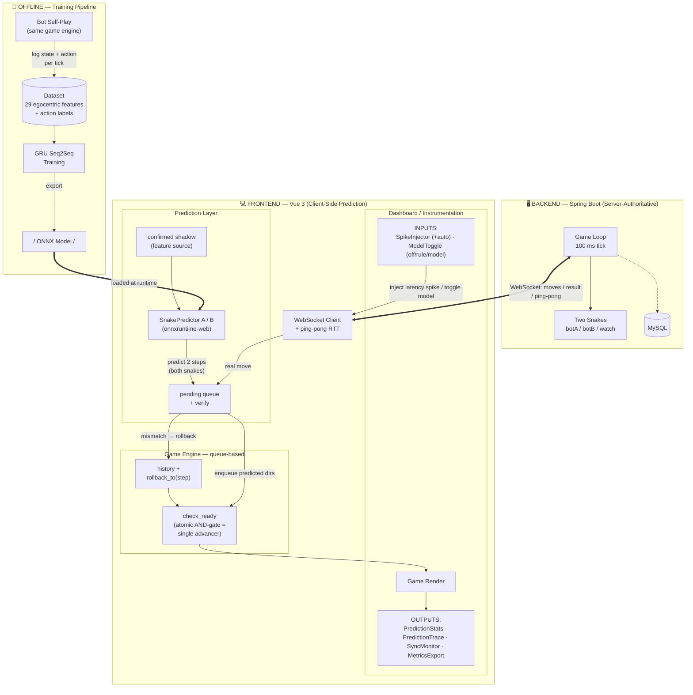
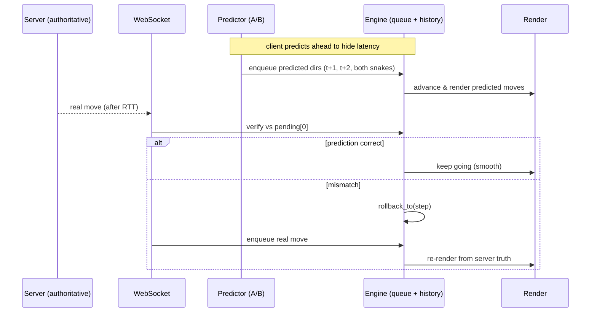

# Project Architecture — Learned Latency Compensation Testbed

## Contents

- [1. System Overview](#1-system-overview)
- [2. Prediction / Reconciliation Loop (per tick)](#2-prediction--reconciliation-loop-per-tick)
- [3. One-line summary](#3-one-line-summary)
- [4. Dashboard Components (Instrumentation Layer)](#4-dashboard-components-instrumentation-layer)
  - [The `ahead` metric](#the-ahead-metric)
- [5. Key Design Rationale (Supervisor Q&A)](#5-key-design-rationale-supervisor-qa)
  - [Q7 follow-up — variable latency / autoregressive](#q7-follow-up--latency-fluctuates--is-non-integer-doesnt-2-step-prediction-break-why-not-dynamicautoregressive-prediction)
- [6. Reading `ahead` correctly — the three-walker model](#6-reading-ahead-correctly--the-three-walker-model)

---

## 1. System Overview



## 2. Prediction / Reconciliation Loop (per tick)



## 3. One-line summary

A **learned sequence model (GRU Seq2Seq)** does **client-side latency compensation** in a
**server-authoritative** game. The server owns truth and creates the latency gap; whenever a
confirmed move is **overdue** (clock-driven, "route-B" — not a measured RTT) the client
predicts up to **2 steps** ahead (K = horizon; tick 100ms) for **both** snakes, renders them
immediately, and **verifies + rolls back** against real server moves. Training data comes
from **bot self-play** in the same engine. A **dashboard** makes a latency **spike**,
predictions, and sync **observable and controllable** for systematic experiments, and the
predictor runs in one of **three modes** — `off` (no prediction) / `rule` (dead-reckoning
baseline) / `model` (GRU) — so the learned model can be benchmarked against a hand-written
rule. Raw per-event metrics are logged and exported (CSV/JSON) for offline analysis; the
evaluation design lives in [`evaluation-plan.md`](./evaluation-plan.md).

---

## 4. Dashboard Components (Instrumentation Layer)

The panels turn invisible latency compensation into something **observable and
controllable**. Two are **inputs (controls)**, the rest are **outputs (observability +
export)**.

| Panel | Role | Type |
|---|---|---|
| **SpikeInjector** | Arm a transient latency **spike** — magnitude (`ms`) × duration (`ticks`) — to reproduce a specific gap on demand → makes experiments repeatable. **Auto** mode auto-fires the spike whenever both snakes are constrained (the gate will open), to efficiently collect gate-open samples. | INPUT |
| **ModelToggle** | Cycle the predictor through **three modes** — `off` (no prediction, raw baseline) / `rule` (dead-reckoning: repeat last confirmed direction) / `model` (GRU) — the evaluation's independent variable, so the GRU is A/B'd against both a rule baseline and no-prediction. | INPUT |
| **PredictionStats** | Cumulative metrics: glides, verified steps, accuracy (Snake A / B), **masked %** (correct & on-screen), **visible-rollback %** (wrong & on-screen), expired. = the model's **live deployment accuracy**, comparable to offline eval. | OUTPUT |
| **PredictionTrace** | Per-event mirror of the console: each **PREDICT** (overdue → glide K) and **VERIFY** (✓ / ✗ rollback, on-screen vs still-queued). | OUTPUT |
| **SyncMonitor** | Track client↔server sync per tick: step, queue depth, fps, pred/idle, and **`ahead`**. Main debugging tool for desync/drift. | OUTPUT |
| **MetricsExport** | Live count of the raw log tables (ticks / renders / verifies / overdues / infers) with **CSV / JSON export** and **Reset**. The exported files feed the offline analysis ([`evaluation-plan.md`](./evaluation-plan.md), [`../analysis/`](../analysis/)); nothing is aggregated by eye in-app. | OUTPUT |

> `LatencyInjector` / `LatencyDisplay` (constant-latency controls) are retained in the
> codebase but **hidden** (`v-if="false"`) for the current spike-only testing.

**Demo order (cause → effect):** SpikeInjector (inject a gap) → SyncMonitor (see `ahead`
rise / felt lag) → PredictionTrace (see the glide & verifies) → PredictionStats (see
accuracy). Cycle **ModelToggle** through `model` → `rule` → `off` to compare the GRU against
dead-reckoning and the raw no-prediction baseline on the same spike.

### The `ahead` metric

**`ahead = engine step (snake0.step) − confirmed server moves (moveCount)`**
= the rendered step relative to the latest confirmed move `M`. The render normally sits **one
step behind `M`** (the 100 ms cell animation is always in flight), so the resting value is **−1**.

| `ahead` | Meaning | Verdict |
|---|---|---|
| **+2** | Two predicted steps rendered ahead of `M` — full ~200ms mask (only reachable on a spike longer than 2 ticks). | ✅ Peak compensation |
| **+1** | One predicted step ahead of `M` — latency being masked. | ✅ Prediction working |
| **0** | Caught up exactly to the latest confirmed move `M` (one step ahead of the resting baseline). | ✅ Compensation engaged |
| **−1** | Resting baseline — render is one step behind `M` because of the 100 ms animation. | ⚪ Normal / healthy |
| **≤ −2** | Fell genuinely behind `M` and is catching up. | ⚠️ Fine if transient; persistent = problem |

**Why it fluctuates:** a *prediction* pushes `ahead` up (−1 → 0 → +1/+2); a server
*confirmation* cashes a step in (falls back); a *rollback* drops a bad lead. No latency → sits
at **−1**; a spike → rises toward +1/+2 then decays back to −1, proving compensation works.
For the full mental model and a tick-by-tick spike walkthrough see
[The Three-Walker Model](./walker-model.md).

---

## 5. Key Design Rationale (Supervisor Q&A)

Speakable English answers + a one-line cue. *(All 8 prepared questions included.)*

**Q1 — Why this project / what's the significance?**
Online multiplayer games are latency-sensitive; the traditional fix is interpolation or
rule-based dead-reckoning. I ask whether a **learned model can predict movement better than
hand-written rules**. Snake is a clean, fully-observable testbed for that.
*Cue: learned model vs rules; snake = means, not goal.*

**Q2 — Why GRU Seq2Seq?**
Movement is **sequential** → a recurrent model is natural. **GRU is lighter than LSTM** with
comparable accuracy → it must run client-side in real time via ONNX. **Seq2Seq** outputs
multiple future steps in one pass.
*Cue: sequential→RNN; light→client; multi-step output.*

**Q3 — Why these features?**
Built around what determines the next move: current direction, a **5×5 occupancy grid**
centered on the head, and the **relative** apple position. Kept **local and egocentric** so
the model generalizes across board positions instead of memorizing absolute coordinates.
*Cue: egocentric → generalization.*

**Q4 — Where does the data come from?**
**Bot self-play** in the same server engine — every sample is real game dynamics,
**auto-labeled**, and the data distribution **matches inference exactly**.
*Cue: real + auto-labeled + same distribution.*

**Q5 — Why client-server architecture?**
It mirrors real online games — the exact setting that needs compensation. The server is
**authoritative** and the client only renders; **that separation is what creates the latency
gap** I'm compensating. All-local → no latency to study.
*Cue: architecture creates the research problem.*

**Q6 — Trained & tested with bots — what's the significance for humans? (sharpest)**
Bots are a **controlled proxy** to validate the **whole pipeline** (predict → verify →
rollback → render) under reproducible conditions. The method is **agnostic to agent type** —
it only sees trajectories. Collecting **human traces** and retraining is the clear next step;
the bot phase **de-risks** the system first.
*Cue: don't dodge; controlled proxy; humans = future work. Say "predict agent movement" (not "player") to stay consistent with Q1.*

**Q7 — Why predict two steps?**
Set by the latency budget: **K = RTT / tick = 200 / 100 = 2** — exactly enough to fill the
gap. Predicting further compounds error with no benefit, since I never render beyond the
latency horizon.
*Cue: derived from latency budget, not arbitrary.*

**Q8 — Why a 100ms tick?**
A deliberate balance: slow enough that one tick is a meaningful prediction unit and the game
stays **playable**, fast enough to feel **continuous** (10 ticks/s), and it maps onto
realistic latencies (50–200ms) so the lookahead is a **small integer**.
*Cue: playable + continuous + matches latency magnitude. (50ms → K doubles → ablation.)*

### Q7 follow-up — "Latency fluctuates / is non-integer; doesn't 2-step prediction break? Why not dynamic/autoregressive prediction?"

**1. Reframe:** The 2-step lookahead is a **buffer ceiling, not an exact latency match**. The
client predicts *up to* 2 steps, queues them, and **continuously verifies and rolls back**
against real moves. Fluctuation in 100–200ms is **absorbed** by this loop, not broken by it —
non-integer latency just means the buffer is partially filled.

**2. True failure mode:** Only when latency **spikes above the horizon** (>200ms) does the
buffer underflow — and then the snake simply **waits one frame**, degrading gracefully to the
**no-prediction baseline, never worse**.

**3. How to set K:** From the **latency distribution (p95), not the mean**. I **already
measure RTT live** via ping-pong, so the signal to make the horizon **adaptive** exists.

**4. Autoregressive:** Yes — my current model is **single-pass (fixed 2 steps)**. An
**autoregressive** decoder would roll forward a **dynamic number of steps matched to live
RTT**, directly solving variable latency. The trade-off is **compounding error / exposure
bias** (it conditions on its own possibly-wrong prediction) — which is why I started with a
robust fixed horizon and treat adaptive autoregressive prediction as the clear next step.
*Cue: ceiling not equals; graceful degrade; p95 + live RTT; autoregressive = dynamic but error accumulation.*

---

## 6. Reading `ahead` correctly — the three-walker model

`ahead` is easy to misread, because "in sync with the data I've **received**" is not the
same as "in sync with the server's **real-time now**". The clearest way to reason about it —
three walkers (rendered / known / server-now), the `felt lag = latency − ahead` relation, and
**tick-by-tick walkthroughs of a latency spike** — lives in its own document:

➡️ **[The Three-Walker Model](./walker-model.md)**

It also covers what each **spike parameter** means (magnitude = depth, duration = width), the
**no-freeze condition** for the current single-shot trigger:

```
masked with no freeze  ⟺  m + n − 1 ≤ K      (m = ms/100, n = ticks, K = horizon = 2)
```

so the reproducible "spike is invisible" demo is **`200 ms × 1 tick`** (Case A), while the
default **`200 ms × 2 ticks`** (Case B) shows the graceful **freeze + snap** floor. The doc
ends with the **rolling top-up** design extension (`freeze ⟺ m > K` — duration absorbed) and
why beating depth `> K` is a **predictability** limit reserved for *future work*.

> The document uses the current metric **`ahead = step − M`** (resting value **−1**: the
> render is one step behind the latest confirmed move due to the 100 ms animation). The
> earlier `step − (M−1)` form (resting value `0`) is superseded and removed.
